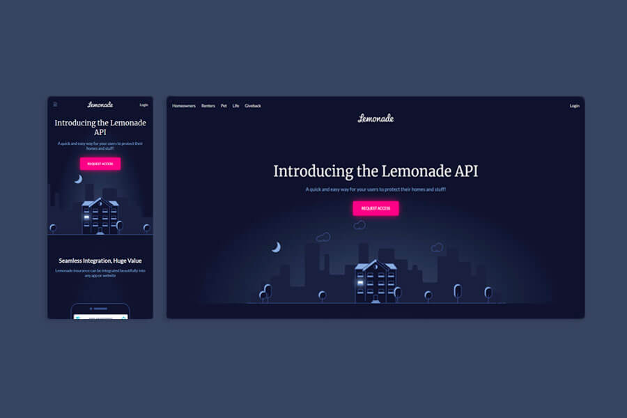

# Lemonade-API Copycat

  Imitación de la web de [Lemonade-API](https://www.lemonade.com/api) como práctica.

  
  
  

## Autor ✒️
**Miriam Andrés** - *Documentación y código*
* [Website](https://miriamandres.com)
* [Github](https://github.com/miriandres)
* [LinkedIn](www.linkedin.com/in/miriandres)

  

## Construido con 🛠️

## Instalación 
Este proyecto no necesita de instalación. Simplemente abre la carpeta o haz doble click en el .html
  
## Contratación
Si quieres contratarme puedes escribirme a hello@miriamandres.com para consultas.

## Licencia 📄
MIT Public License v3.0
No puede usarse comercialmente.